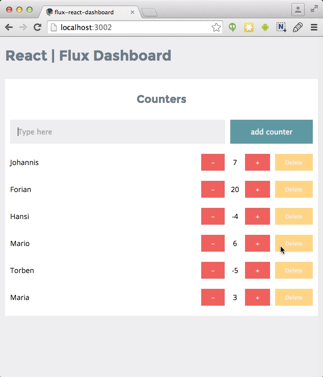

# React - Flux & Firebase Dashboard

react-flux-dashboard is an application built with flux, react and firebase to show how the different concepts and technologies all working together. The intention is to build a whole dashboard of all kinds of widgets to show how react and flux works with multiple stores and components.

### What you get:

- React UI
- Flux architecture
- Firebase
- SASS
- Webpack builds
- ES6 syntax (Babel)

### Get started

Download the dependencies:

```
    npm install
```

Start the application via:

```
    npm start
```

Go to http://localhost:3002/

### The Counter widget functionality:

- Add a named counter to a list of counters
- Increment any of the counters
- Decrement any of the counters
- Delete a counter
- Todo: Show a Sum of all counter values
- Todo: Add a named counter with a specific start value to a list of counters

<p align="center">
  
</p>

### Todo:

- Authentication
- Serverside Rendering
- More Widgets
